# Module 4 Lesson 1- Lab 2A: Azure Health Bot

## Overview

The Microsoft Azure Health Bot service is a cloud platform that empowers developers in healthcare organizations to build and deploy their AI-powered, compliant, conversational healthcare experiences at scale. It allows businesses to offer your users intelligent and personalized access to health-related information and interactions through a natural conversation experience.

With the service, healthcare organizations can build a health bot instance and integrate it with their systems that patients, nurses, doctors, and other representatives can interact with. Building an instance allows you to improve processes, services, outcomes, and cost.

Azure Health Bot service contains a built-in medical database, including triage protocols. You can also extend a health bot instance to include your own scenarios and integrate with other IT systems and data sources To learn more about Azure Health Bot, see [Azure Health Bot Overview](https://docs.microsoft.com/en-us/azure/health-bot/) on Microsoft Docs.

## Industry prioritized scenarios

Azure Health Bot focuses on the Enhance patient engagement priority scenario by creating a virtual bot health option to allow for new avenues of care with embedded insights.

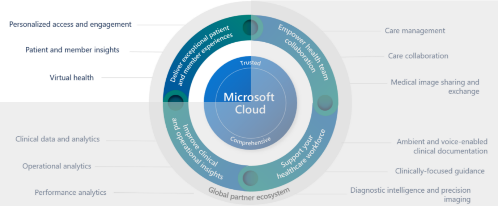

This lab focuses on Lamna Healthcare Company.

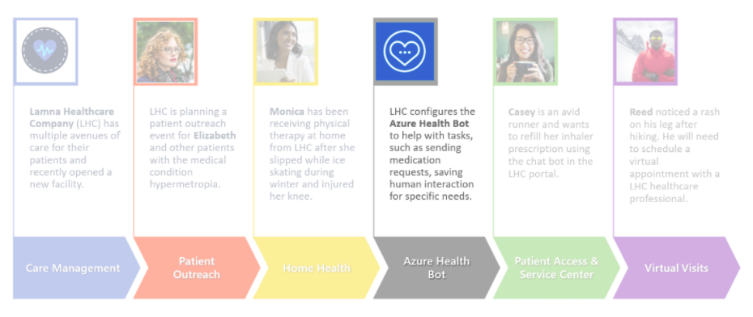

As part of their digital transformation efforts, Lamna Healthcare Company is seeking to streamline their patient engagement capabilities by implementing Azure Health Bot to help improve processes and services, such as entering medication requests. By allowing patients to interact with this service, Lamna Healthcare Company moves one step closer to their goal of improving patient outcomes while reducing overall costs.

In this module, you play the role of a Lamna Healthcare IT developer. You create and set up your own Azure Health Bot with a custom scenario that allows for medication refills and escalating to a service center agent.

## Exercise 1: Redeem Azure Pass and Create a Patient Portal

### Task: Redeem Azure Pass

1.	Open a new tab on your browser and browse to the **Microsoft Azure Pass** website using the [Azure pass](https://www.microsoftazurepass.com/.)
link.

2.	Click on **Start**.
 

3.	Enter the Office 365 tenant credentials. Click on **Sign-in.**

4.	Verify email id and then click on **Confirm Microsoft Account.**
 

5.	Paste the **promo code** in the **Enter Promo code** box and click **Claim Promo Code**.
 

6.	It may take few seconds to process the redemption.

7.	Fill in the details appropriately on the **Sign up** page.

8.	On the **Agreement** window, select the check box - I agree to the subscription agreement, offer details, and privacy statement, and then click on **Sign up**. You may also **Submit** the feedback.
 

### Task: Register an app in Azure AD

In this task, you'll learn how to register a new application in Microsoft Azure Active Directory (Azure AD), grant delegated and application permissions, and create a client secret.

1.	While signed into your **Microsoft 365 tenant**, open a new browser tab, and then go to the [Azure portal](https://portal.azure.com/). In the upper-left corner of the page, select the hamburger icon (three horizontal lines) and then select **Microsoft Entra ID**.
 
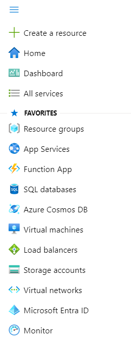

2.	On the left navigation pane, select **App registrations** and then select **+ New registration** in the right pane.
 

3.	On the **Register an application** page, enter the name for the bot as **MCH Application ID** and then select the **Accounts in any organizational directory (Any Azure AD directory - Multitenant)** option under the **Supported account types** section. Then, select **Register**.

4.	Select **API permissions** on the left navigation pane. On the right pane, select **+ Add a permission.**

5.	On the **Request API permissions** page, select **APIs my organization** **uses**. Use the search box to search for the string **Dataverse**. From the search result, select **Dataverse**.
 
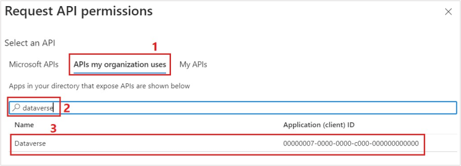

6.	Select **Delegated permissions**. Under the **Select permissions** section, select the checkbox beside **user_impersonation**. Then, select **Add permissions**.

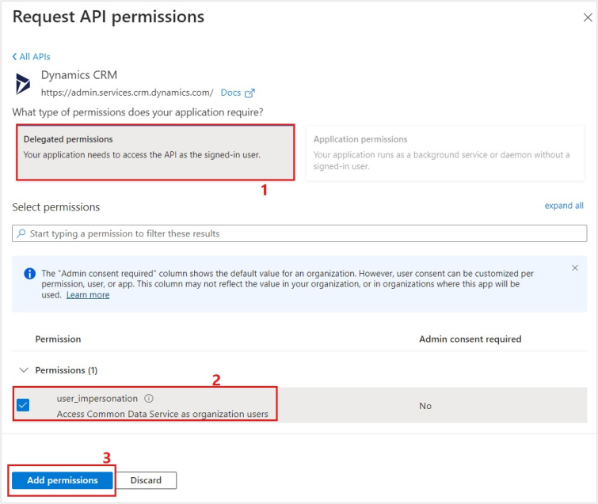

7.	Select **API permissions** on the left navigation pane. On the right pane, select **+ Add a permission.** Select **Microsoft APIs** and then select **Microsoft Graph.**
 

8.	On the **Request API permissions** page, select **Application permissions**. Use the search box to search for the string **calendars**. Select the checkbox beside **Calendars.ReadWrite**.

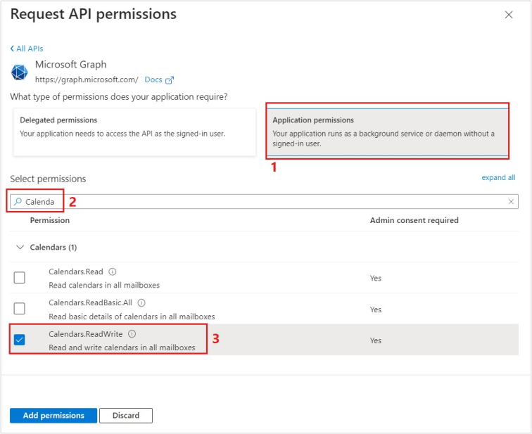

9.	On the **Request API permissions** page, select **Application permissions**. Use the search box to search for the string **user.read**. Select the checkbox beside **User.Read.All**.
 

10.	On the **Request API permissions** page, select **Delegate permissions**. Use the search box to search for the string **user.read**. Select the checkbox beside **User.Read.All** and then select **Add permissions.**
 
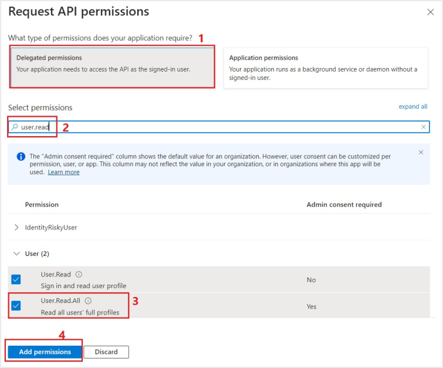

11.	Select **Grant admin consent**, as shown in the following screenshot.

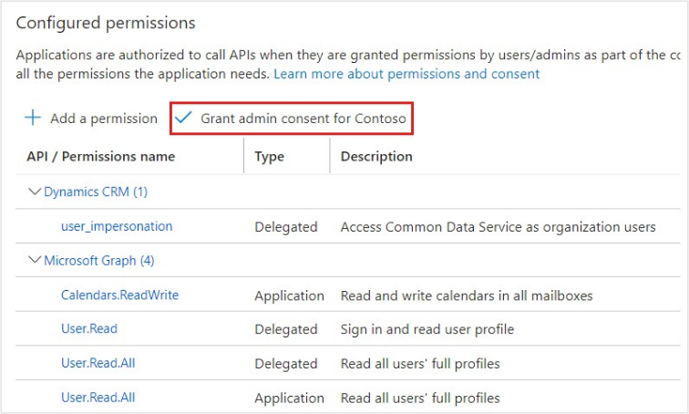

12.	On the **Grant admin consent confirmation** pop-up window, select **Yes**.
 

The status for each added permission will change to **Granted**, as shown in the following screenshot.

13.	On the left navigation pane, select **Certificates & secrets**, and then in the right pane, select **+ New client secret**. On the **Add a client secret** blade, provide the **Description** as **Demo Health Bot,** leave the **Expires** value at its default setting, and then select **Add**.
 
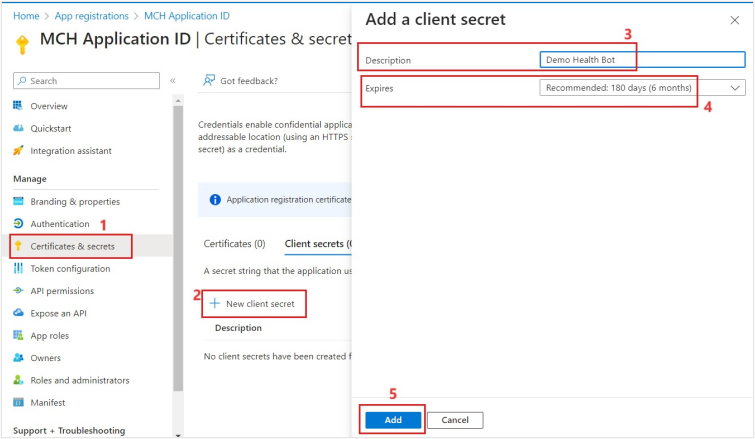

**Note**- You'll need to create an application secret so that you can use it along with this application ID to authenticate the bot.

14.	Copy the secret value and then save it in a notepad so that you can use it later in this learning path.

**Note** - After you've created the secret and the page has refreshed, the secret value will no longer be available to copy.

15.	On the left navigation pane, select **Overview tab**. From the right pane, copy the **Application (client) ID** and then save it in a notepad so that you can use it later in this learning path.
 
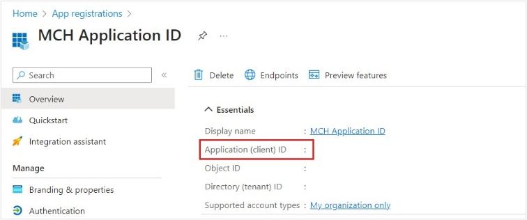

### Task: Create the Lamna Healthcare Patient Portal app

1.	Open a new tab and login to [Power pages portal](https://make.powerpages.microsoft.com/) with your credentials. Change the environment on the top-right corner of the home page to the trial that you are using in Power Apps.

2.	Click on **Create a site** on the home page.
 
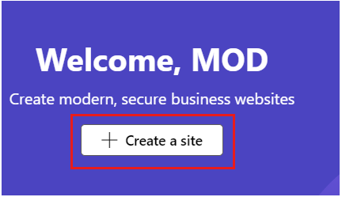

3.	Enter **Customer** in the **Search** area and Select the **Customer Self Service Portal.**
 
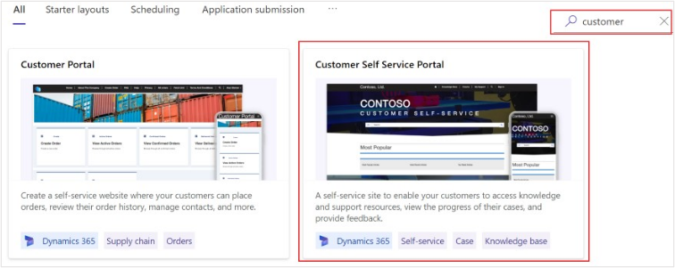

**Note** – If you are unable to see Customer service template, please proceed with creating a site with any random template. Log off from power pages and login back, You will now be able to see the Customer Self Service portal template.

4.	Select **Choose this template.**
 

5.	Enter **Name** of the site as **Lamna Healthcare patient portal** and Web address as **LamnaPatientPortal** (If you get the message that the URL is not available, you can try with different names). You can provide the name and address of your choice. Once provided, click on Done.
 
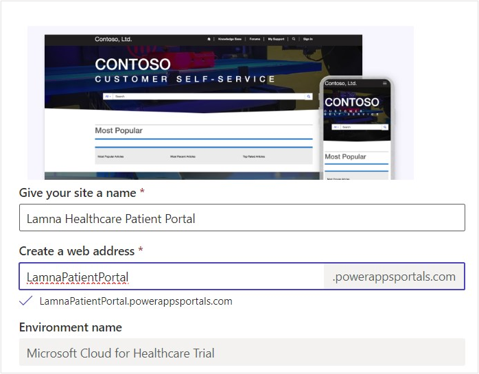

6.	The portal will take some time to configure.
 

7.	The site will be ready in 5-10 minutes
 

## Set up Azure Health Bot

Azure Health Bot empowers developers in healthcare organizations to build and deploy AI-powered, compliant, conversational healthcare experiences at scale. It combines a built-in medical database with natural language capabilities to understand clinical terminology, and you can customize it to support your organization's clinical use cases. The service ensures alignment with industry compliance requirements and is privacy protected to Health Insurance Portability and Accountability Act (HIPAA) standards. For more information, see [Azure Health Bot documentation.](https://learn.microsoft.com/en-us/azure/health-bot/)

In this exercise, you'll complete the following tasks:

1. Set up Azure Health Bot from the Azure portal.

2. Set up and enable integration between Omnichannel for Microsoft Dynamics 365 Customer Service and Azure Health Bot.

3. Set up and enable a bot channel to obtain a bot ID.

4. Obtain the application client ID for your health bot to use later.

### Task: Install Azure Health Bot in Azure subscription

Follow these steps to install the Azure Health Bot in an Azure subscription.

1.	While signed into your Microsoft 365 tenant, open a new tab in your internet browser in Incognito or InPrivate mode and then go to the [Microsoft Azure portal.](https://portal.azure.com/)

2.	Search for **Azure Health Bot** in the search bar and then select it from the search results.
 
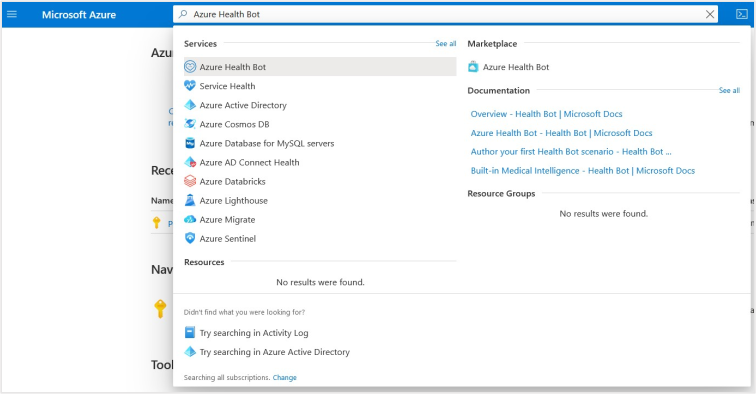

3.	Select the **Create** button to create a new Azure Health Bot instance.
 

4.	You'll be redirected to the **Azure Health Bot** page, where you can enter the following information:

    o	**Subscription** - Choose your Azure subscription

    o	**Resource group** - Use the resource group that you created in environment preparation

    o	**Name** - [username]-healthbot (you can choose any name)

    o	**Region** - Select the closest region

    o	**Plan** - Free (F0)

5.	Select **Review + create.**
 

6.	On the **Review + create** page, verify that your details are correct as Azure validates your Health Bot. When the create button has been enabled after validation passes, select **Create**.

**Note** - It will take a few seconds for the system to run the process before the **Create** button is enabled.

You'll be redirected to the **Deployment** page for your new Azure Health Bot.

7.	When the deployment is complete, the **Go to resource** button will be enabled. Wait until the deployment has completed for the Azure Health Bot and then select **Go to resource.**

8.	You'll be redirected to the **Resource** page for your new Azure Health Bot. Select the **Management** **portal** link on the right of the **Essentials** section to open your Azure Health Bot instance setup page. Select your username for sign-in, if prompted.

**Note** - Copy this **Management portal** link and store it to access the Health Bot later.
 
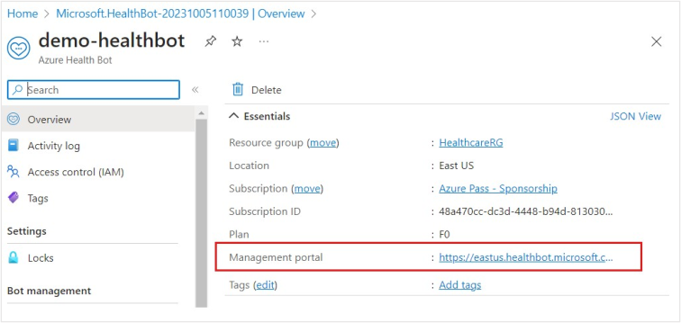

9.	Your new Azure Health Bot instance homepage should appear.

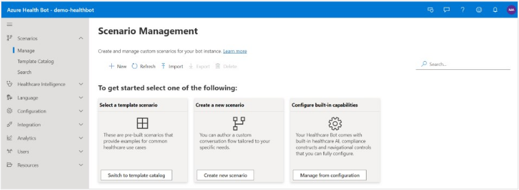

You've successfully created a new Health Bot instance in your Azure tenant.

### Task: Update Azure Health Bot settings to enable Dynamics 365 integration

To update Azure Health Bot settings to enable Dynamics 365 integration, follow these steps:

1.	Select **Configuration > Conversation** on the left navigation bar, which will open the **Interactions** tab.

2.	Select the **Human Handoff** tab in the **Conversation Configuration** settings.

3.	Scroll to the bottom of the **Human Handoff** page. Under **Dynamics 365 OmniChannel**, switch the **Bridge Messages** toggle to **Enabled**. This option is required to allow communication and bridge messages between the Azure Health Bot and Omnichannel for Dynamics 365 Customer Service. Select **Save** after enabling the feature.

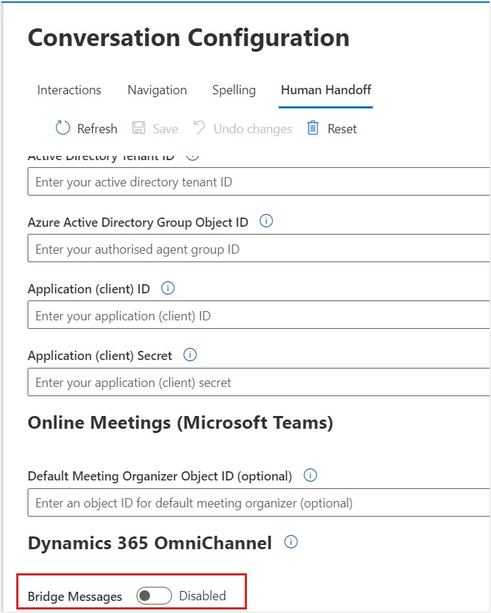

4.	Go to **Integration > Channels** on the left navigation pane. Enable the Health Bot for the **Microsoft Teams** and **Omnichannel** channels.

5.	In the **Channels** list, select the toggle to enable **Microsoft Teams.**

6.	A pop-up window will appear with your **Bot ID** information. Copy and store the Bot ID value for later when you create the Dynamics 365 application user. Select **Create**.

7.	In the **Channels** list, select the toggle to enable **Omnichannel**.

8.	The Bot ID should be the same as the Teams channel, then select **Create** .

Microsoft Teams and Omnichannel channels are enabled and active.

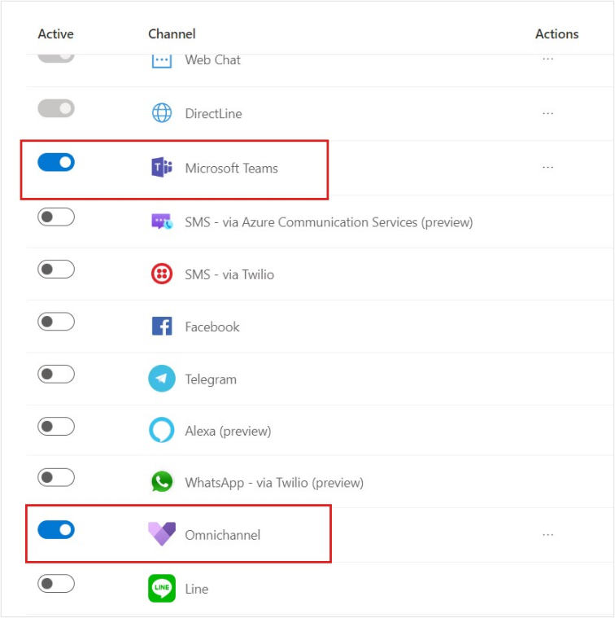

You've completed the Azure Health Bot settings for integration with Microsoft Teams and Omnichannel for Dynamics 365 Customer Service.

### Task: Obtain an Azure application ID

In this task, you'll be using the Azure application ID that you created in your Azure tenant during environment preparation. You might have called it "**MCH Application ID**". Registering this ID established a trusted relationship between your Dynamics 365 app and the Microsoft identity platform.
You'll now obtain the client ID and store it to later create a Dynamics 365 application user to bridge the authentication between Azure Health Bot and Microsoft Power Apps.

1.	Return to the Azure portal and search for **App registrations** in the search box. Select the **App registrations** service.
 

2.	The **App registrations** homepage opens with the **Owned applications** tab.

3.	Select the **All applications** tab and then enter **MCH Application ID** in the search box to search for your application ID.

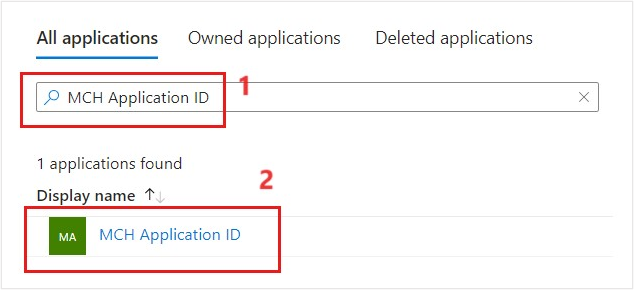

4.	Select the **MCH Application Id** app registration resource. Copy and store the **Application (client) ID** for later when you create the Dynamics 365 application user.

**Note** - ID values have been removed in the screenshot for privacy purposes.

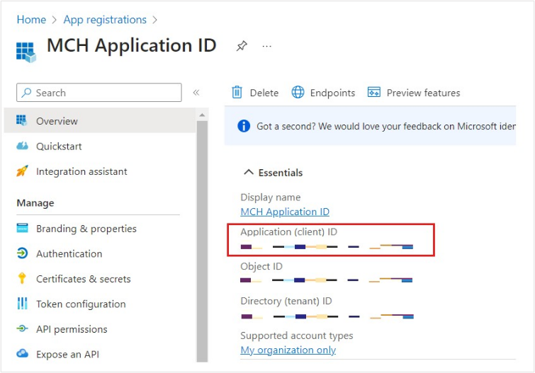

You've successfully obtained the MCH Application ID from the **Application registrations** page in the Azure portal.
