# Module 4 Lesson 2 Lab 4: Care Management

## Overview

Care Management focuses on the **Enhance patient engagement** and **Empower health team collaboration** priority scenarios. It creates a system that allows for a 360-degree view of patient healthcare data with patient insights, enhanced care team collaboration, and virtual care options.    

This lab will focus on the story of Lamna Healthcare Company, who is opening a new location in Redmond, WA.

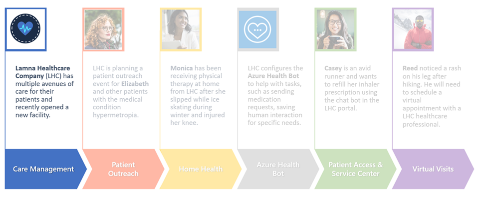

Now that Lamna Healthcare Company's new location is ready to open, it needs to be entered into the system. Additionally, employees must understand the healthcare data model and how the data is displayed in the Care Management application.

The following exercises in this module help you learn more about the Care Management application:

•	Explore the healthcare data model and how patient details, clinical data, and care plan data are related.

•	Navigate the unified patient view of a patient record in the Care Management application.

•	Create a location record for Lamna Healthcare Company.

•	Add a new patient information in the Care Management App.

## Exercise 1: Explore the Healthcare Data Model

In this exercise, you will learn about the core care management data tables. If you’d like to explore the tables in deeper detail on Microsoft Docs, please visit [Overview of Microsoft Cloud for Healthcare entities](https://docs.microsoft.com/en-us/common-data-model/schema/core/industrycommon/healthcare/healthcare-overview).

The healthcare data model uses some of the out-of-the-box tables from Dynamics 365 applications. The following Healthcare solutions use the built-in Dynamics 365 tables:

| Healthcare solution    | Dynamics 365 tables                                      |
|------------------------|----------------------------------------------------------|
| Care Management        | Account, Activities, Contact, Tasks                      |
| Home Health            | Bookings, Incident, Products, Work Order                 |
| Patient Outreach       | Lead/Lead Score, Marketing Emails, Contact, Tasks        |
| Patient Service Center | Agent Script, Knowledge Article, Queues, Survey Response |

Visit [Healthcare data model overview](https://docs.microsoft.com/en-us/dynamics365/industry/healthcare/overview-data-model) on Microsoft Docs to learn more about the Healthcare data model.

### Task 1: Navigate Patient Details Tables and Relationships

In this task, you will explore the main tables related to Patient Data. Select each table name to navigate to the Microsoft Docs page that goes into detail about each table.

**Patient Detail Table Definitions**

| Table Name | Definition |
|----|----|
| **Patient (Contact)**, https://docs.microsoft.com/en-us/common-data-model/schema/core/industrycommon/healthcare/administration/administrationcore/contact | Person with whom a business unit has a relationship, such as customer, supplier, and colleague. |
| **AllergyIntolerance**, https://docs.microsoft.com/en-us/common-data-model/schema/core/industrycommon/healthcare/clinical/clinicalcore/allergyintolerance | Risk of harmful or undesirable, physiological response which is unique to an individual and associated with exposure to a substance. |
| **Condition**, https://docs.microsoft.com/en-us/common-data-model/schema/core/industrycommon/healthcare/foundational/commoncore/condition | A clinical condition, problem, diagnosis, or other event, situation, issue, or clinical concept that has risen to a level of concern. |
| **MedicationRequest**, https://docs.microsoft.com/en-us/common-data-model/schema/core/industrycommon/healthcare/foundational/commoncore/medicationrequest | An order or request for both supply of the medication and the instructions for administration of the medication to a patient. |
| **RelatedPerson**, https://docs.microsoft.com/en-us/common-data-model/schema/core/industrycommon/healthcare/foundational/commoncore/relatedperson | Information about a person that is involved in the care for a patient, but who is not the target of healthcare, nor has a formal responsibility in the care process. |

See below for the **Patient Detail Entity Relationship Diagram**.

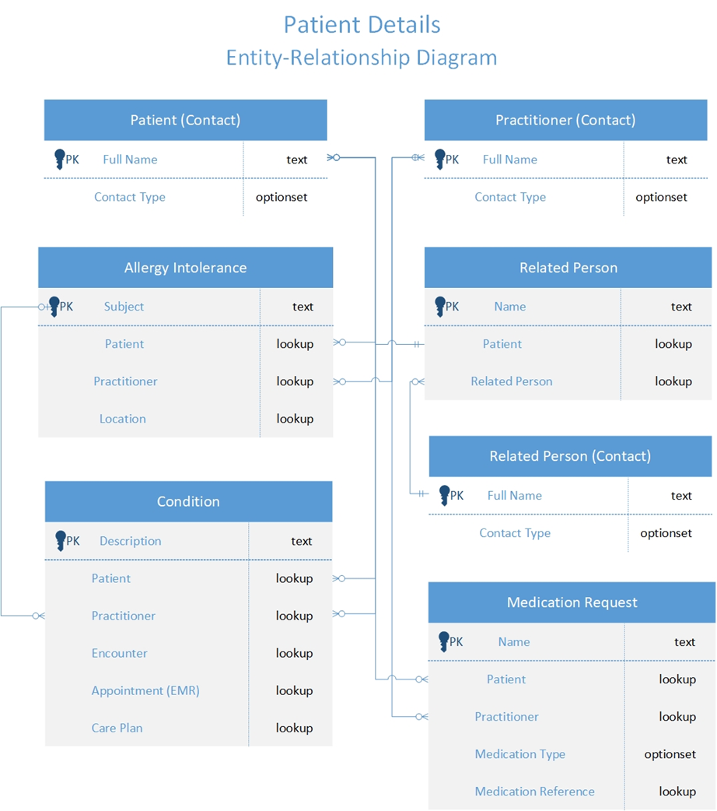

### Task 2: Navigate Clinical Data Tables and Relationships

In this task, you will explore the main tables related to Clinic Data. Select each table name to navigate to the Microsoft Docs page that goes into detail about each table.

**Clinical Data Table Definitions**

| Table Name | Definition |
|----|----|
| **Patient or Practitioner (Contact)**, https://docs.microsoft.com/en-us/common-data-model/schema/core/industrycommon/healthcare/administration/administrationcore/contact | Person with whom a business unit has a relationship, such as customer, supplier, and colleague. |
| **Organization**, https://docs.microsoft.com/en-us/common-data-model/schema/core/applicationcommon/organization | Top level of the Microsoft Dynamics 365 business hierarchy. The organization can be a specific business, holding company, or corporation. |
| **Location**, https://docs.microsoft.com/en-us/common-data-model/schema/core/industrycommon/healthcare/foundational/commoncore/location | Details and position information for a physical place where services are provided and resources and participants may be stored, found, contained or accommodated. |
| **AppointmentEMR**, https://docs.microsoft.com/en-us/common-data-model/schema/core/industrycommon/healthcare/foundational/commoncore/appointmentemr | A booking of a healthcare event among patient(s), practitioner(s), related person(s) and/or device(s) for a specific date/time. This may result in one or more Encounter(s). |
| **Procedure**, https://docs.microsoft.com/en-us/common-data-model/schema/core/industrycommon/healthcare/foundational/commoncore/procedure | An action that is or was performed on a patient. This can be a physical intervention like an operation, or less invasive like counseling or hypnotherapy. |
| **Encounter**, https://docs.microsoft.com/en-us/common-data-model/schema/core/industrycommon/healthcare/foundational/commoncore/encounter | An interaction between a patient and healthcare provider(s) for the purpose of providing healthcare service(s) or assessing the health status of a patient. |
| **EpisodeOfCare**, https://docs.microsoft.com/en-us/common-data-model/schema/core/industrycommon/healthcare/foundational/commoncore/episodeofcare | An association between a patient and an organization / healthcare provider(s) during which time encounters may occur. |
| **Observation**, https://docs.microsoft.com/en-us/common-data-model/schema/core/industrycommon/healthcare/foundational/commoncore/observation | Measurements and simple assertions made about a patient, device or other subject. |
| **CodeableConcept**, https://docs.microsoft.com/en-us/common-data-model/schema/core/industrycommon/healthcare/foundational/commoncore/codeableconcept | A Codeable Concept represents a value that is usually supplied by providing a reference to one or more terminologies, but may also be defined by the provision of text. |

See below for the **Clinical Data Entity Relationship Diagram**.

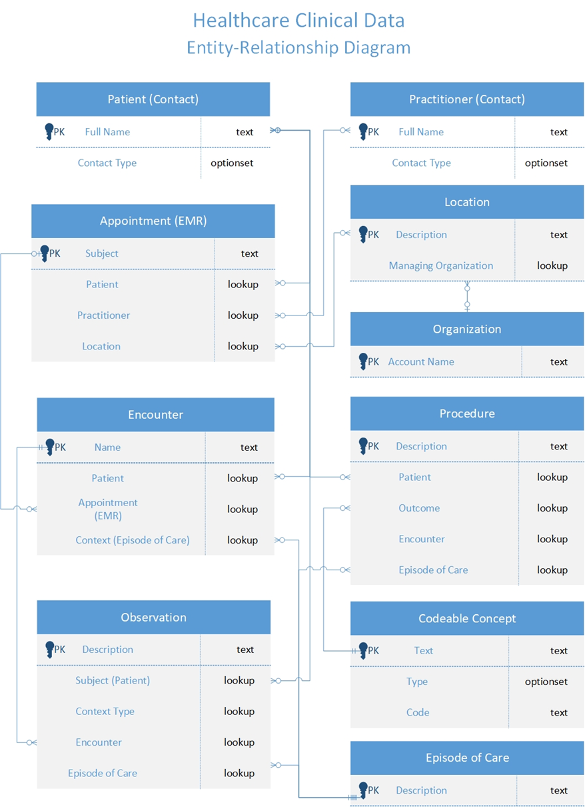

### Task 3: Navigate Care Plan Management Tables and Relationships

In this task, you will explore the main tables related to Care Plan Management. Select each table name to navigate to the Microsoft Docs page that goes into detail about each table.

**Care Plan Management Table Definitions**

| Table Name | Definition |
|----|----|
| **Patient (Contact)**, https://docs.microsoft.com/en-us/common-data-model/schema/core/industrycommon/healthcare/administration/administrationcore/contact | Person with whom a business unit has a relationship, such as customer, supplier, and colleague. |
| **CarePlan**, https://docs.microsoft.com/en-us/common-data-model/schema/core/industrycommon/healthcare/foundational/commoncore/careplan | Describes the intention of how one or more practitioners intend to deliver care for a particular patient, group or community for a period of time, possibly limited to care for a specific condition |
| **CarePlanActivity**, https://docs.microsoft.com/en-us/common-data-model/schema/core/industrycommon/healthcare/clinical/clinicalcareteam/careplanactivity | Identifies a planned action to occur as part of the plan. For example, a medication to be used, lab tests to perform, self-monitoring, education, etc. |
| **CarePlanActivityGoal**, https://docs.microsoft.com/en-us/common-data-model/schema/core/industrycommon/healthcare/clinical/clinicalcareteam/careplanactivitygoal | Internal reference that identifies the goals that this activity is intended to contribute towards meeting. |
| **Goal**, https://docs.microsoft.com/en-us/common-data-model/schema/core/industrycommon/healthcare/clinical/clinicalcareteam/goal | Target objective for a user or a team for a specified time period. |
| **CarePlanGoal**, https://docs.microsoft.com/en-us/common-data-model/schema/core/industrycommon/healthcare/clinical/clinicalcareteam/careplangoal | Describes the intended objective(s) of carrying out the care plan. |
| **Encounter**, https://docs.microsoft.com/en-us/common-data-model/schema/core/industrycommon/healthcare/foundational/commoncore/encounter | An interaction between a patient and healthcare provider(s) for the purpose of providing healthcare service(s) or assessing the health status of a patient. |
| **Episode of Care**, https://docs.microsoft.com/en-us/common-data-model/schema/core/industrycommon/healthcare/foundational/commoncore/episodeofcare | An association between a patient and an organization / healthcare provider(s) during which time encounters may occur. |

See below for the **Care Plan Management Entity Relationship Diagram**.

## Exercise 2: Navigate Care Management Application

In this exercise, you'll navigate the patient record and explore information that's captured in the Care Management application. In this scenario, you'll examine the unified patient view to observe how a care team member would obtain a full view of clinical and non-clinical data for a specific patient.

1.  Navigate to [Power apps portal](http://make.powerapps.com) in an In-Private or Incognito window. If you are in an official training class, sign in with your assigned user.

2.	In Power Apps, select **Apps** on the left navigation pane. Select and open **Care Management** by clicking on the **play** button.
 
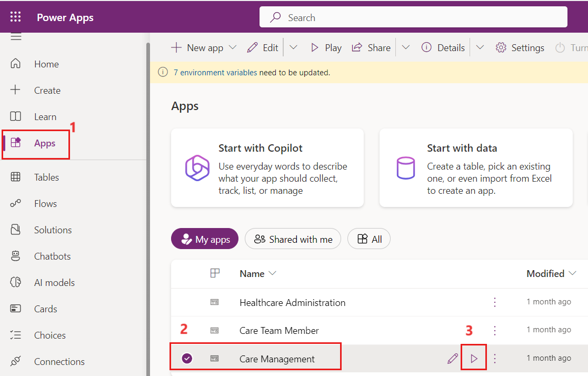

3.	You'll be directed to **Health Analytics** under **Care management.** 
 
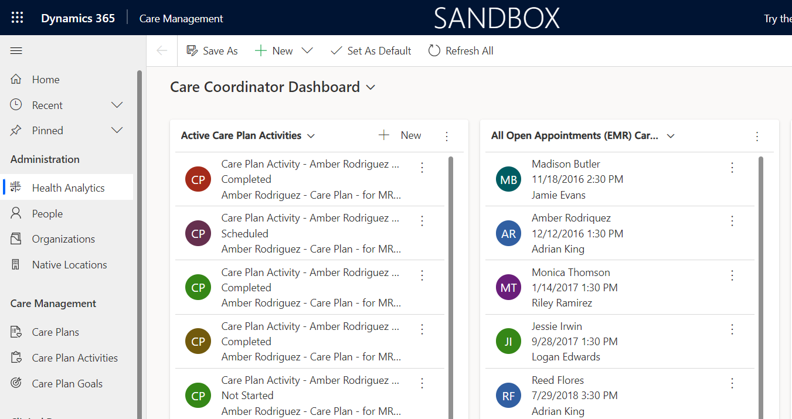

The Care Coordinator Dashboard view is as shown in the below image.

 

4.	Select **People** on the left navigation pane. Note that the default view is **Active Patients**. In your own time, you can switch the view to **Active Practitioners** and explore the practitioners form to observe how it differs from the patient form.
 

5.	Find and select **Amber Rodriguez** from the **Active Patients** view. Open the record by double-clicking or selecting **Edit** in the command bar.

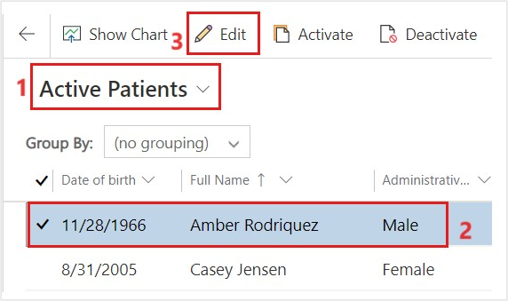 

6.	In the **Patient-Clinical** form, examine the **Summary** tab on Amber's patient record. The purpose of the patient record is to give a comprehensive view of Amber's latest information.

 
   1.	The **Patient snapshot** section displays a customizable view of the patient information. Select an item to display the details of the record on the right panel of the form.

   2.	In the **Active conditions** section, review Amber's preexisting conditions. You can drill down for more information or create a new condition for the patient.

   3.	In the **Clinical details** section, cycle through the various icons to review different medical details, including **Medications and prescriptions, Encounters, Results and diagnostics,** and **Procedures**. This method is simple and efficient for observing patient healthcare details.

   4.	**Assistant** section provides an overview of notifications so that the admin can check back later to stay updated.

   5.	Review the **Patient Interactions** section, which shows any activity, note, or post. You can filter and sort this section if necessary.

7.	Select the **Profile** tab.

8.	The **Profile** tab includes extra and non-clinical information, including the **Patient information, Patient relationships, Patient contact methods, Insurance coverage, Claims,** and **Medical identifiers** sections.

 
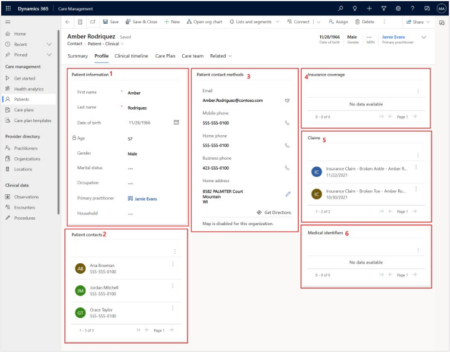

9.	Select the **Clinical timeline** tab. On this tab, a care team member can view a weekly calendar of the patient's clinical information and a list of upcoming or previous events.
 

10.	Select the **Upcoming events** dropdown menu on the right pane to view **Previous events.**
 
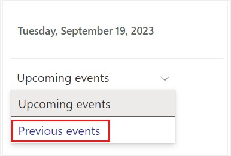

11.	Review the list of events that Amber had previously, including appointments, care plans, encounters, and medication requests.

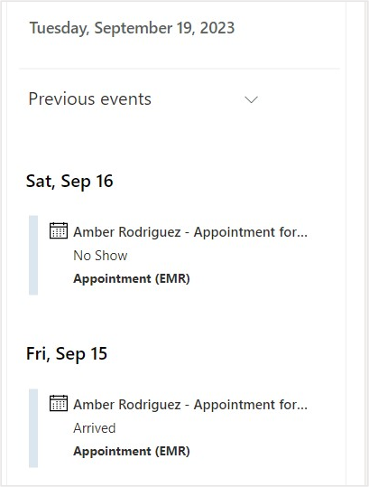 

12.	Select the **Care Plan** tab. On this tab, the care team member has a full view of all care plans that are associated with the patient. This tab also includes a list of the patient's care plan activities and statistics for completed activities and goals. You can create a new care plan or filter by care plan type in this view.

 

13.	Select the **Care team** tab. On this tab, the care team member can find other members who might be providing care to the patient for current conditions and care plans.
 

14.	Select the **Related** tab to view other details that are related to the patient record.

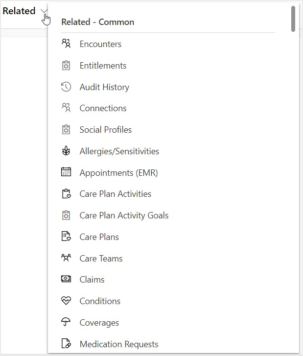 

You've now explored the starting dashboards and the unified patient view features in the Care Management application.

   
## Exercise 3: Create a New Location

In this exercise, you will be creating a new Location record for the **Lamna Healthcare Company** Organization. They have opened a new branch in **Redmond, WA** and we need to ensure this location is in the system.

1.	In the Care Management application, select **Native Locations** in the left navigation pane under **Administration**.

2.	In the **All Locations** view, select **+ New**
 
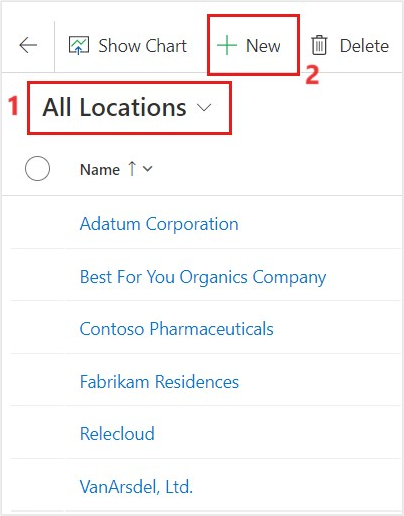

3.	Fill in the following information for the new location:

    o	**Name** - Lamna Healthcare - Redmond, WA

    o	**Address City** - Redmond

    o	**Address State** - WA

    o	**Managing Organization** - Lamna Healthcare Company

4.	Select **Save & Close.**

 

5.	In the left navigation, select **Organizations** to review the new location in its managing organization record. Change the grid view in the dropdown menu from **My Active Accounts** to **Active Accounts.**

 

6.	While in the **Active Accounts** view, select the **Lamna Healthcare Company** organization.

 

7.	On the Lamna Healthcare Company record, select the **Related** tab and then scroll down to select **Locations**.

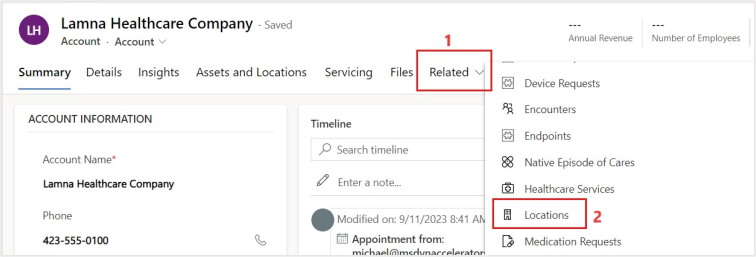 

The newly created **Lamna Healthcare - Redmond, WA** location will show as associated with the record.

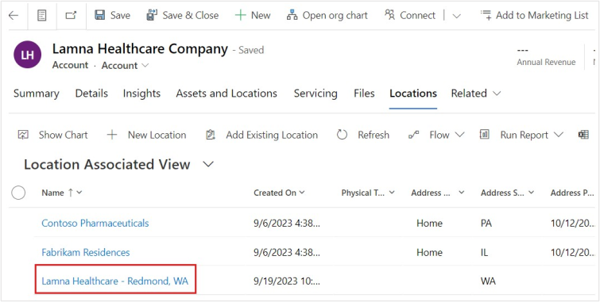 

You've now created a new location in Redmond, WA for Lamna Healthcare Company and have viewed it in the associated organization in the Care Management application.

## Exercise - Add Patient information in Care Management App

In this task, you continue to walkthrough by creating a new **Patient** and **Patient Encounter** record in the Care Management app, then assigning it a **Care Plan** and a **Care Team** based on the patient’s details. 

1.	Create a new **Patient** record in **Care Management** app by performing the following steps:

    a.	On top right corner of the **Care Management** home page, click on the **+** icon.

    b.	Select **Contact** from the list.
 

2.	Create a new **patient** record by filling out the following information:

    a.	**Contact Type**: Patient

    b.	**First Name**: Emma 

    c.	**Last Name**: Williams

    d.	**Email**: emmawilliams@contosopersonal.com

    e.	**Mobile Phone**: (561) 754-3010

    f.	**Business Phone**: (431) 754-3010

    g.	Click on **Save and Close**
 
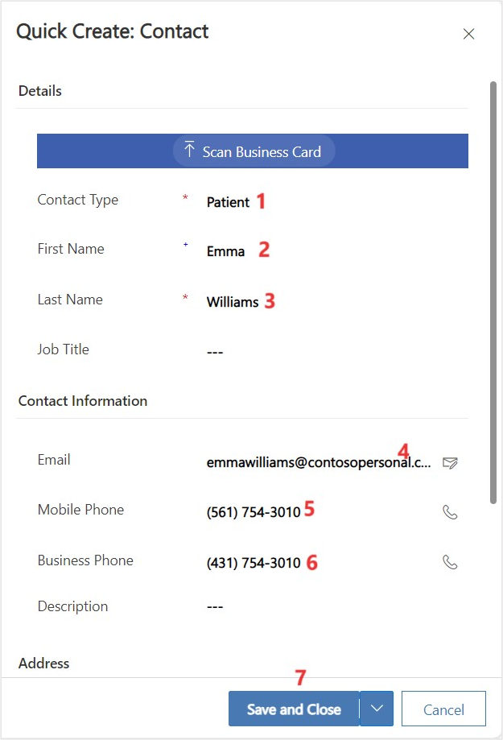

3.	Click on the record you just created.
 
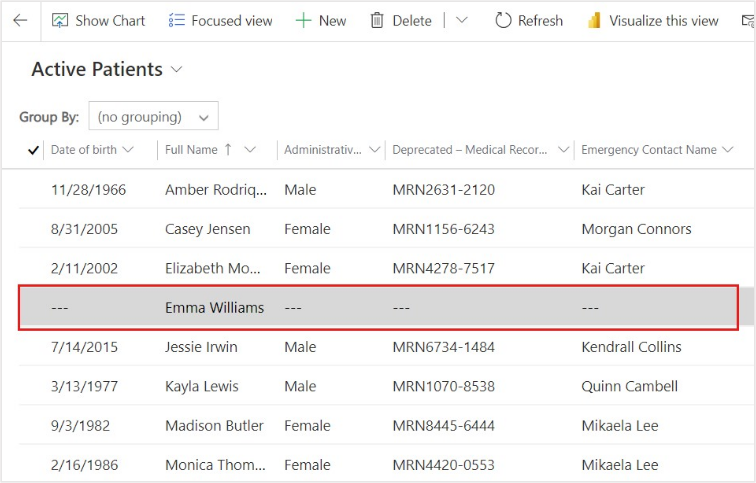

4.	Go to **Profile** tab. Enter the below details

    a.	Click on Edit icon for Home address and update the below details

       i.**Address**: 4 Illinois Drive

       ii.**City**: Bronx

       iii.**State/Province**: New York 

       iv.**Zip code**: 10452

       v.**Country**: United States of America
 

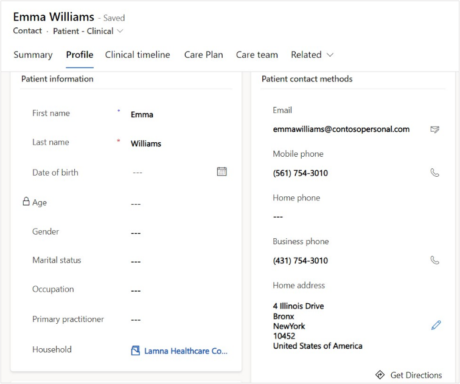

5.	Click on **Save**.

6.	Click on **Related** drop-down and select **Encounters**.
 

7.	Click on **New Encounter.**
 
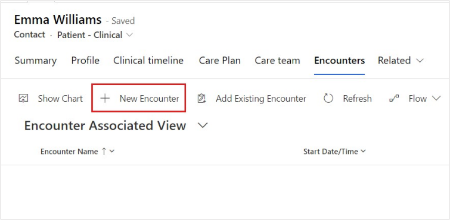

8.	Enter the following details for the new encounter:

    a.	**Name**: Regular Test

    b.	**Patient**: Emma Williams

    c.	**Status**: Planned 

    d.	**Start Date**: Tomorrow’s date - 8 AM

    e.	**End Date**: Tomorrow’s date – 11 AM

    f.	**Priority**: Routine

    g.	**Destination**: Lamna Healthcare Company

    h.	Click on **Save and Close.**
 
 

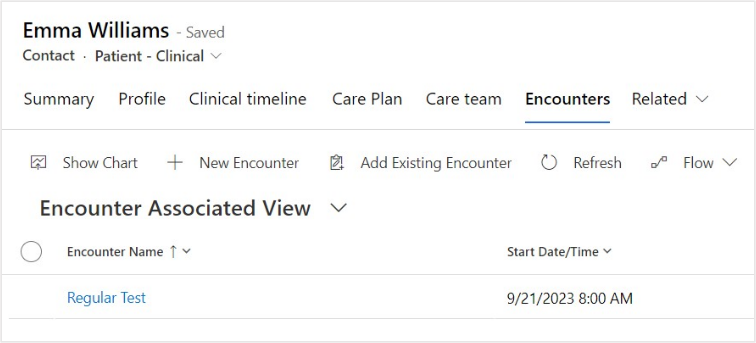

9.	We will proceed with creating a new **Care Plan** and **Care Plan Team** for the Patient that we created in the previous step. In this step, we will create a **Care Plan** with one or more **Care Team member(s)** so that the whole care team can collaborate and provide better healthcare for the patient. Click on **Care Plan** tab. Click on **Blank** from the list.
 

10.	Enter the following details for new care plan:

    a.	**Plan name** - Emma Williams - Care Plan

    b.	**Status**: Active

    c.	**Start Date**: Tomorrow’s date and time is 8 AM

    d.	**End Date**: Tomorrow’s date and time is 11 AM 

    e.	**Encounter**: Regular Test

    f.	Click on **Save and Close**

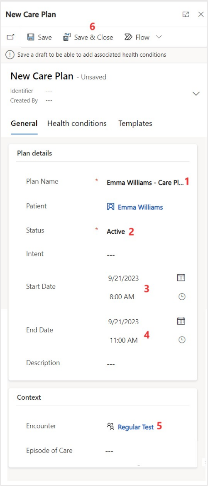 

11.	Create a Care team by clicking on **Care team** tab and selecting **Add a new care team.**
 
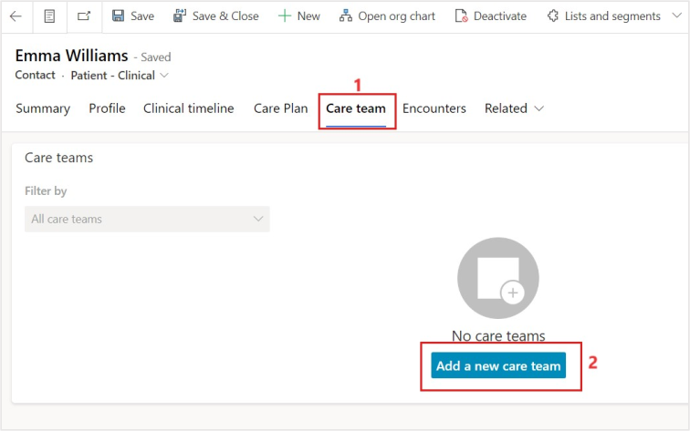

12.	Enter the following details on the create new team wizard.

     a. Under **Create care team**

       i.**Care team name**: Emma Williams – Care Team

       ii.**Care plan**: Emma Williams – Care Plan

       iii.	**Context type**: Encounter

       iv.**Encounter**: Regular Test

 
    b.	Under **Add members**

       i.**Select member type** – Practitioners

       ii.**Search members** – Adrian King
 
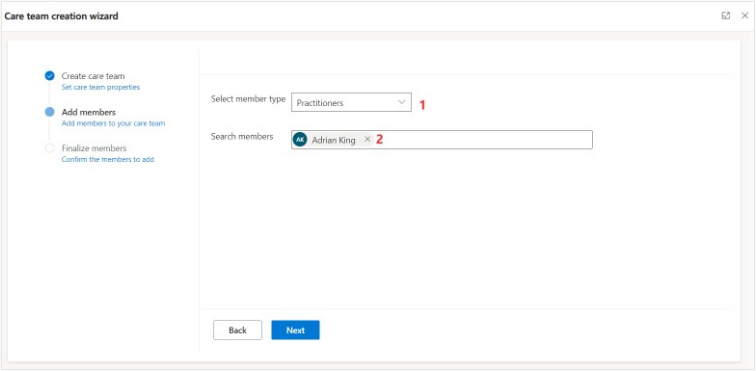
    
    c.	Select member type – **Related persons** and add **Cameron Baker.** Click on **Next**.
 
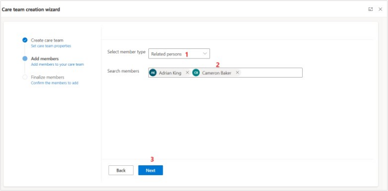

13. Click on **Submit**.
 

In this module till now, you explored the Administration section of the Care Management application. In your own time, you can continue through the other sections of the application, including Care Management, Clinical Data, and Templates.
