# Module 5 Lesson 4 Lab 11: Export and Anonymize Data

## Overview

In this lab, you will learn how to export de-identified data from the FHIR service.

Healthcare organizations frequently conduct research studies with patient medical records as the main source of data. This type of study where patient health records are used for non-treatment purposes is referred to as "secondary use" research. In the U.S., access to patients' Personal Health Information (PHI) for secondary use is strictly controlled by two federal regulations: **The Revised Common Rule** (at https://www.hhs.gov/ohrp/regulations-and-policy/regulations/finalized-revisions-common-rule/index.html) and the **Health Insurance Portability and Accountability Act (HIPAA)** (at https://www.cdc.gov/phlp/publications/topic/hipaa.html#:~:text=The%20Health%20Insurance%20Portability%20and,the%20patient's%20consent%20or%20knowledge). In the latter case, researchers are not allowed to access patients' PHI unless the information has been de-identified following HIPAA guidelines. De-identification (or anonymization) of PHI involves removing details from patients' medical data that could reveal patients' identities. HIPAA specifies two methods of de- identification: the **HIPAA Safe Harbor Method** (at https://www.hhs.gov/hipaa/for-professionals/privacy/special-topics/de-identification/index.html#safeharborguidance) and the **HIPAA Expert Determination Method** (at https://www.hhs.gov/hipaa/for-professionals/privacy/special-topics/de-identification/index.html#guidancedetermination). In this lab, we will get practice using the Azure health data platform to de-identify and export FHIR data according to a set of data redaction/transformation rules.

In this lab, you will be using the \$export command in the FHIR service to export de-identified FHIR data into an ADLS Gen2 blob storage container. The \$export operation in FHIR service is an implementation of the bulk export function detailed in the **FHIR Bulk Data Access specification** located at https://hl7.org/fhir/uv/bulkdata/export/index.html. To familiarize yourself with the FHIR service \$export operation, please read the **How to export FHIR data** article located at https://docs.microsoft.com/en-us/azure/healthcare-apis/fhir/export-data and return here when finished.

## Exercise 1: Review sample anonymization configuration and customize as needed

1.  Review the sample configuration file, provided by Microsoft, [here](https://docs.microsoft.com/en-us/azure/healthcare-apis/fhir/de-identified-export#configuration-file). It demonstrates how de-identification works between the FHIR service and an ADLS Gen2 account. In real-world use, you would need to review the HIPAA guidelines and customize the configuration file with additional anonymization rules (e.g., rules for redacting/transforming patient names).

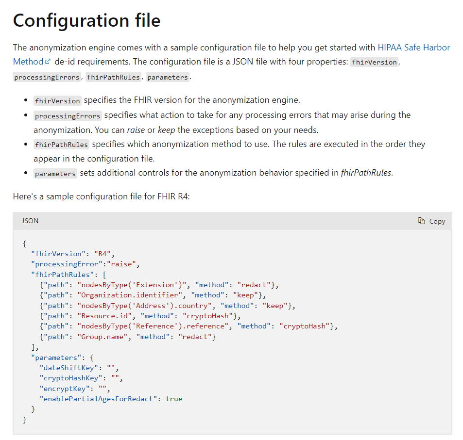

## Exercise 2: Configure storage account for export

1.	Select **Resource groups.**
 

2.	Select your **Azure Health Data services** resource group you created.

3.	Select your **FHIR Service.**
 
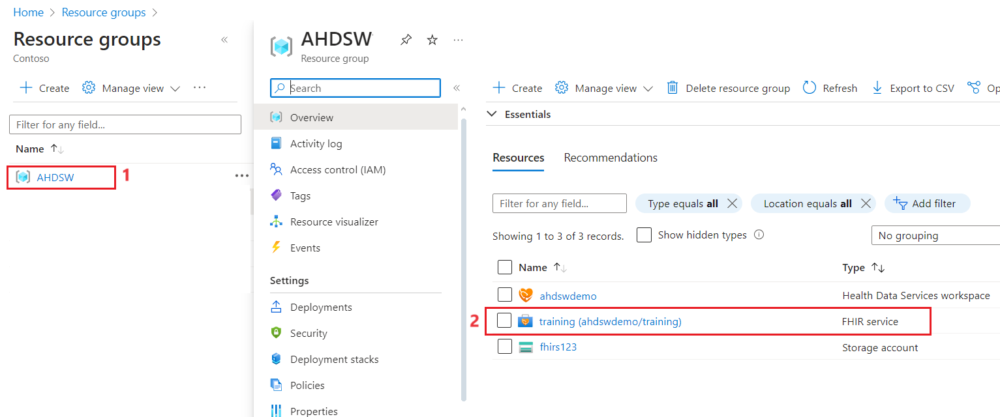

4.	Select **Identity** blade on the left navigation pane under **Settings**.
 
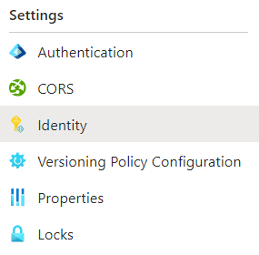

5.	Set the **Status** option to **On**.
 
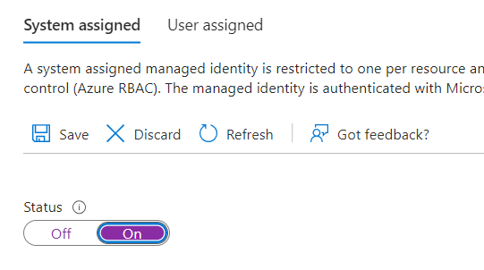

6.	Select **Save** and confirm save by selecting **Yes** to enable managed identity for the FHIR Service.
 

7.	Once the system identity has been enabled, you'll see an **Object (principal) ID** value for your FHIR service.
 
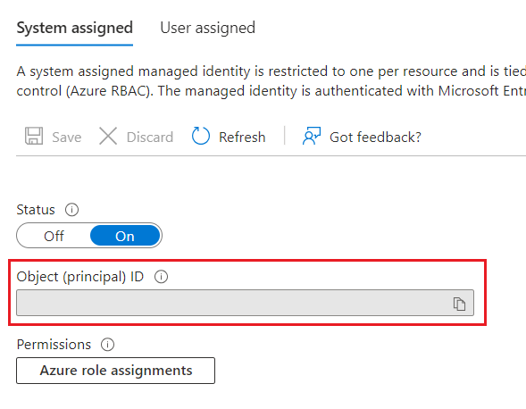

## Exercise 3: Give permission in the storage account for FHIR service access 

8.	When you deployed Azure components in Lab 7, a managed identity was automatically enabled for your FHIR service. 

9.	We need to assign the **Storage Blob Data Contributor** role to the managed identity in the **ADLS Gen2 storage account** in your resource group. 

10.	Enter **Resource groups** in the search area.

11.	Select your **Azure health data service** resource group. 

12.	Select your Storage account. 
 

13.	In your Storage Account, select **Access control (IAM)** from the left navigation pane.
 

14.	Select **Add > Add role assignment.** 
 

15.	On the **Role** tab, select the **Storage Blob Data Contributor** role.
 
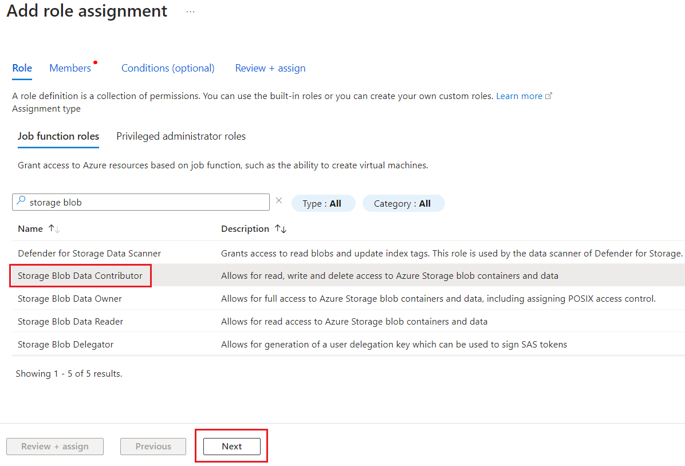

16.	On the **Members** tab, select **Managed identity**, and then click **+ Select members.**
 

17.	On the **Select managed identities** pane that appears on the right side, select your **Azure subscription.**

18.	Select **FHIR Service** for the **Managed identity** field.

19.	On the **Select** tab, select the managed identity that you enabled earlier for your FHIR service.

20.	Choose **Select**.
 

21.	Similarly, select users again and add your admin user. Click **Review + assign** twice to assign the **Storage Blob Data Contributor** role to your FHIR service.
 
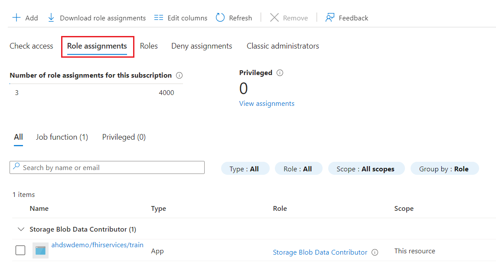

22.	Please perform the same steps for the role - **Storage Queue Data Contributor**

## Exercise 4: Specify the storage account for FHIR service export

The final step is to specify the ADLS Gen2 account that the FHIR service will use when exporting data.

**Note** - In the storage account, if you haven't assigned the Storage Blob Data Contributor role to the FHIR service, the $export operation will fail.

1.	Go to your FHIR service. Under overview tab, on the right-side pan, click on **Configure Export.**
 
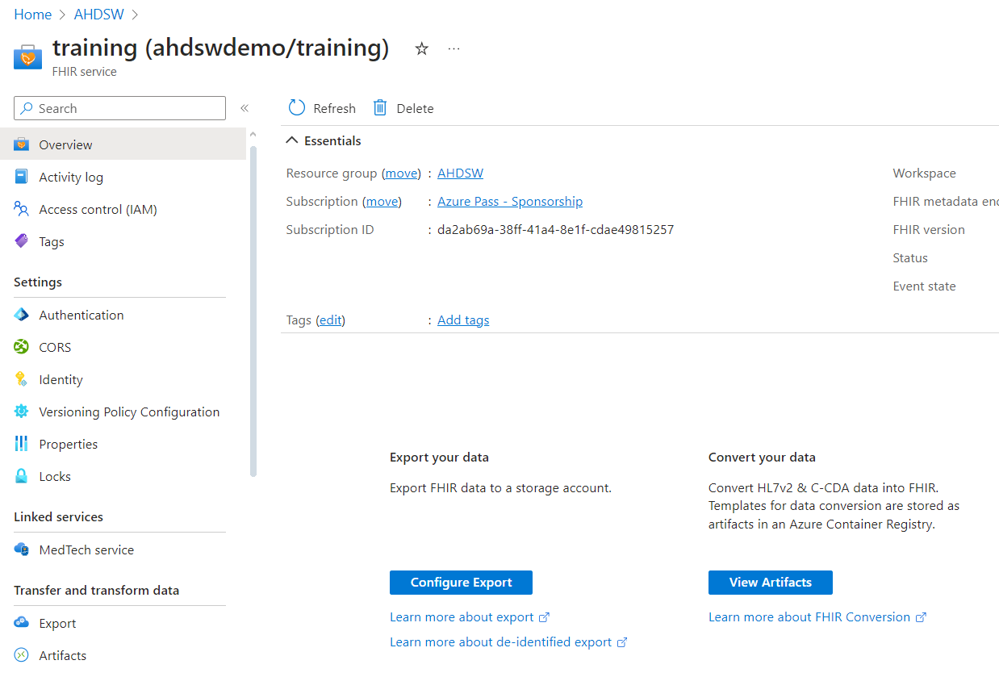

2.	Select the storage account and click on **Save**.
 

After you've completed this final configuration step, you're ready to export data from the FHIR service. See [How to export FHIR data](https://learn.microsoft.com/en-us/azure/healthcare-apis/fhir/export-data) for details on performing $export operations with the FHIR service.

5.	Follow the instructions in the **Exporting de-identified** **data** article located at (https://docs.microsoft.com/en-us/azure/healthcare-apis/fhir/de-identified-export)

6.	Upon scrolling down, copy the sample configuration file and save it as **anonymizationConfig.json** file to the VM. 

7.	Go to your storage account under your **Azure health data service** resource group

8.	select **Containers** under **Data storage** on the left navigation pane.

9.	Select the container named **anonymization**.
 
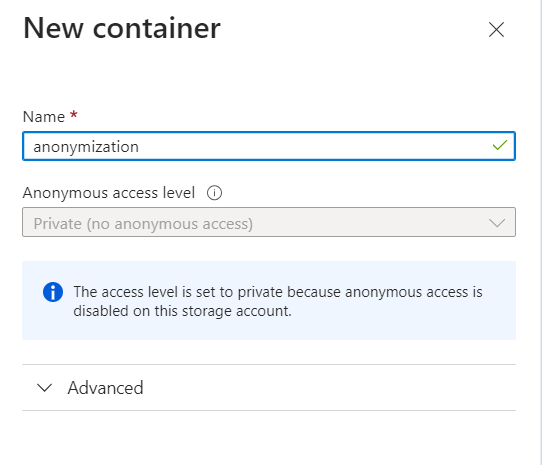

10.	Go to the **container** and select **Upload**.
 

11.	From the files select **anonymizationConfig.json** file that you saved earlier.

12.	Then select **Upload**.

 

## Exercise 5: Export anonymized data

Now you will go to the FHIR CALLS collection in Postman and prepare a new $export request to de-identify and export FHIR data. This API call will cause the FHIR service to create a new folder inside the anonymization container in the "expsa" storage account and export all Resources to the new folder. The PHI in the Resources will be de-identified following the rules defined in the anonymizationConfig.json file.

You can create a new request in Postman by clicking on the existing GET List Patients request and selecting Duplicate from the View more actions menu. Select Rename and name the new request GET Export Anonymized FHIR Data (the GET should already be present on the left).

The general form of the request string will be:

GET {{fhirurl}}/$export?_container={{containerName}}&_anonymizationConfig={{configFilename}}

1.	Open your **Postman** **workspace**.

2.	Select your **fhir-service** environment.
 
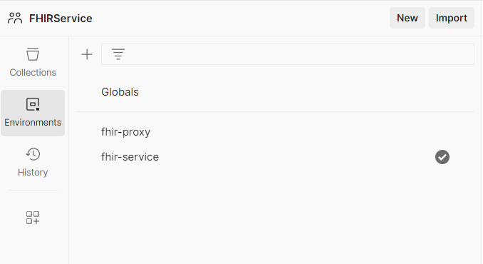

3.	Click on **Collections**. Go to your **FHIR CALLS** collection and prepare a new **$export request** to de-identify and export FHIT data.

4.	Select the ellipses (…) next to **FHIR CALLS** and then select **Add request.**
 
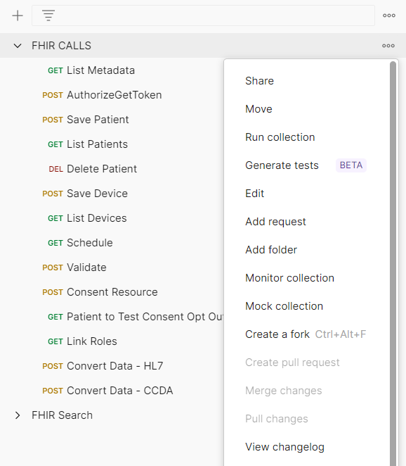

5.	Change the request name to **Export Anonymized FHIR Data**

6.	Copy the following request URL and paste it into **FHIR URL** field. 

        {{fhirurl}}/$export?_container={{containerName}}&_anonymizationConfig={{configFilename}}

7.	In the copied value, replace the **ContainerName** and **configFileName** with the following values:

    **ContainerName** – anonymization

    **configFileName** - anonymizationConfig.json
 

8.	Go to the **Authorization** tab for the **GET Export Anonymized FHIR Data** request and make sure that **Inherit auth from parent** is selected.
 

9.	Go to the **Headers** tab.

10.	Add the following Keys and Values:

   	i. **Accept**: application/fhir+json

    ii.	**Authorization**: Bearer {{bearerToken}}

    iii. **Prefer**: respond-async

12.	Select **Save**.
 
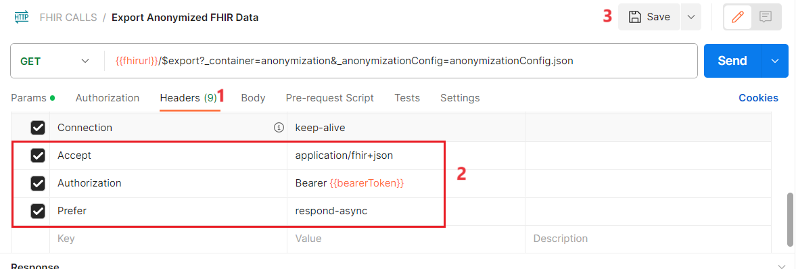

13.	Once everything is set up and ready to go, with the **$export** request selected, press **Send** in Postman to initiate the request.

14.	You should receive a 202 Accepted response.
 
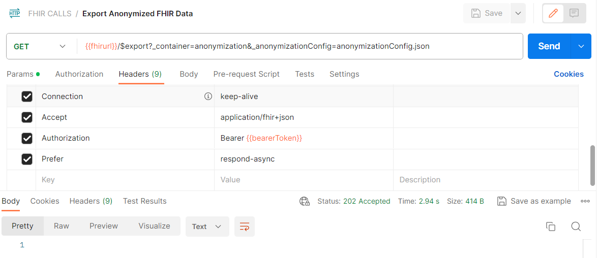

15.	Now if you go to your storage account in Azure portal, there should be a new folder within the **anonymization** container. 
 
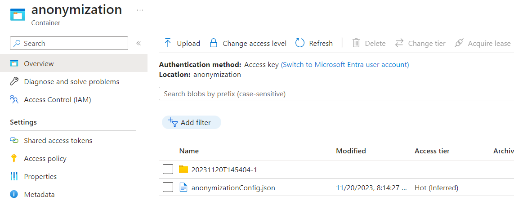

16.	Go to this folder to access the de-identified FHIR data that you just exported.
 
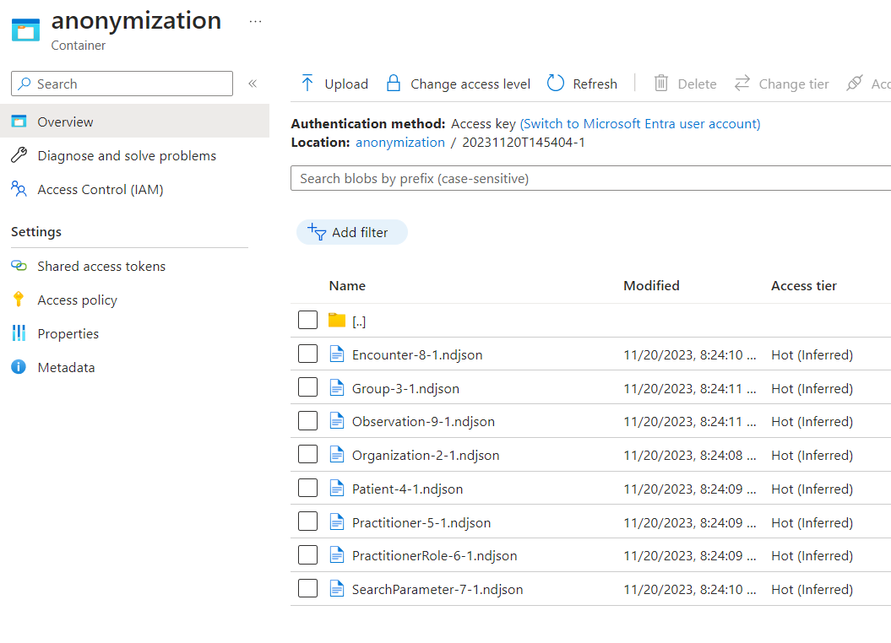

17.	Inside the folder, each row will have three dots on the right side. Select these three dots and select **View/Edit.**
 
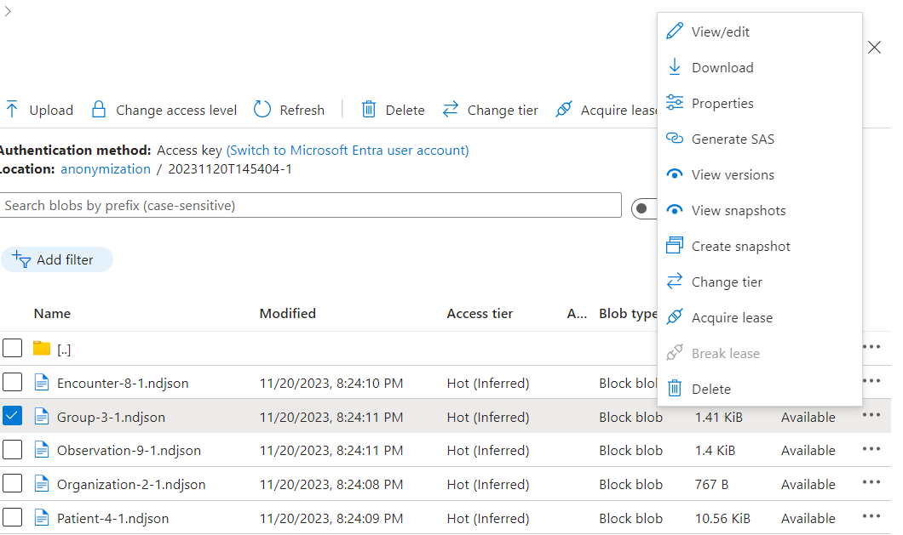

18.	You will notice that information has been removed/redacted from the FHIR records per the anonymization rules defined in the anonymizationConfig.json file.
 

## Exercise 6: Securely transfer the files to the research team

Researchers from outside organizations cannot have direct access to healthcare or payer organizations' Azure tenants. You will need to find a way to securely transfer the anonymized data to these external groups.

1.	Right-click the container and select **Shared access tokens** from the dropdown menu
 
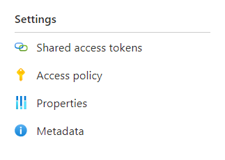

2.	Select **Signing method → User delegation key**.
 
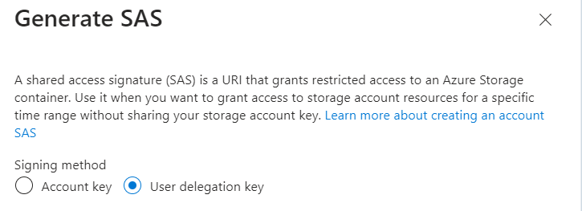

3.	Define **Permissions** by checking and/or clearing the appropriate check box:

    o	Your **source** container or file must have designated **read** and **list** access.

    o	Your **target** container or file must have designated **write** and **list** access.
 
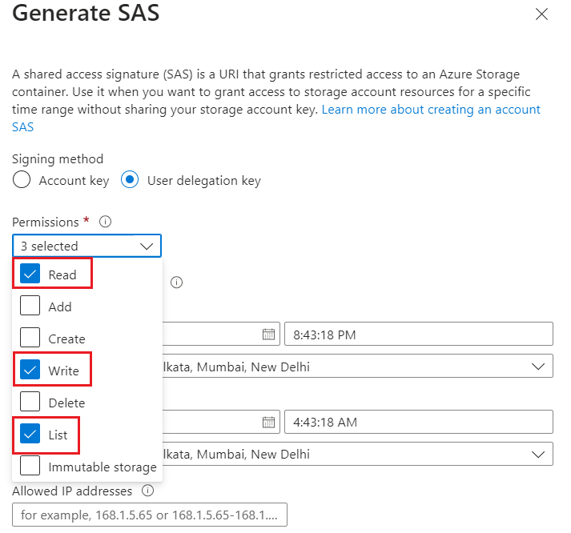

4.	Specify the signed key **Start** and **Expiry** times.

    o	When you create a shared access signature (SAS), the default duration is 48 hours. After 48 hours, you'll need to create a new token.

    o	Consider setting a longer duration period for the time you'll be using your storage account for Translator Service operations.

    o	The value for the expiry time is a maximum of seven days from the creation of the SAS token.
 
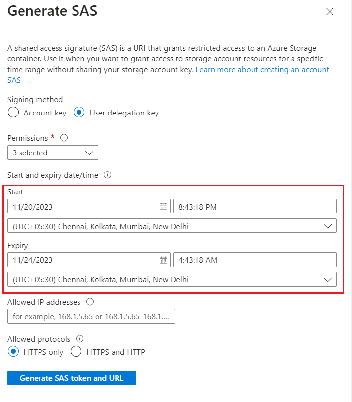

5.	The **Allowed IP addresses** field is optional and specifies an IP address or a range of IP addresses from which to accept requests. If the request IP address doesn't match the IP address or address range specified on the SAS token, it won't be authorized.

6.	The **Allowed protocols** field is optional and specifies the protocol permitted for a request made with the SAS. The default value is HTTPS.

7.	Review then select Generate SAS token and URL.
 
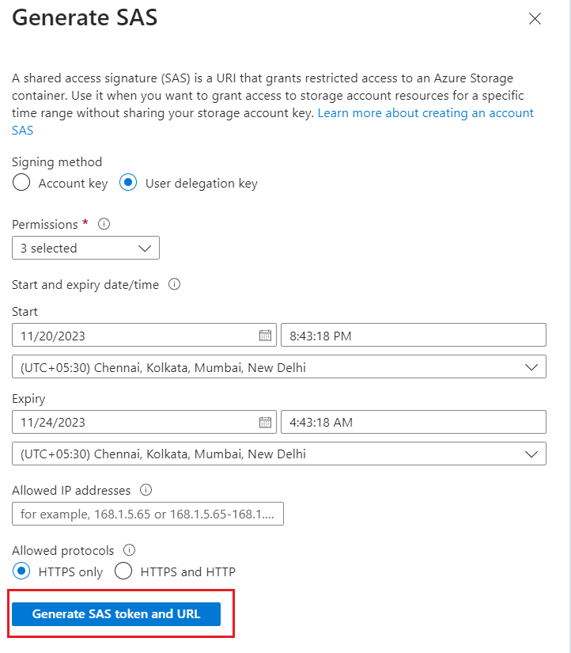

8.	The **Blob SAS token** query string and **Blob SAS URL** will be displayed in the lower area of window.
 
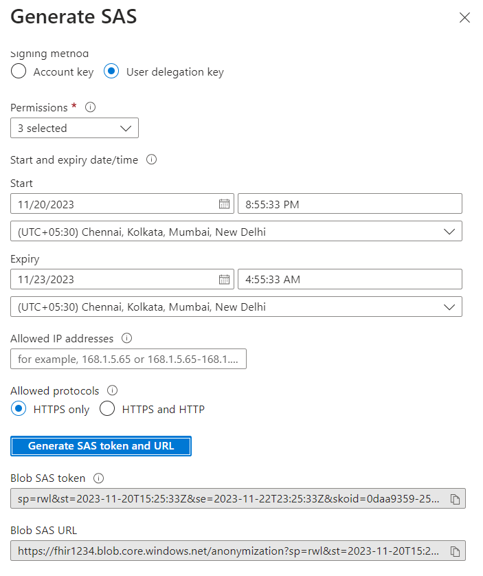

**Note** - Copy and paste the Blob SAS token and URL values in a secure location. They'll only be displayed once and cannot be retrieved once the window is closed. To [construct a SAS URL](https://learn.microsoft.com/en-us/azure/cognitive-services/Translator/document-translation/how-to-guides/create-sas-tokens?tabs=Containers#use-your-sas-url-to-grant-access), append the SAS token (URI) to the URL for a storage service.

**Note** - Pay special attention to the "Permissions" section of the above documentation. Reading files and listing files in a container are two different permissions.
