# Module 6 Lesson 4 Lab 13: DICOM Service

## Overview

In this lab, you will get experience working with medical images using the DICOM service in Azure Health Data Services.

The DICOMweb™ standard at (https://www.dicomstandard.org/using/dicomweb) is the RESTful API protocol used throughout the health industry for medical image storage, querying, and exchange. The DICOM service within Azure Health Data Services (see https://docs.microsoft.com/azure/healthcare-apis/healthcare-apis-overview) is a DICOMweb™-compliant server that ingests and persists DICOM objects at multiple thousands of images per second. DICOM service in Azure Health Data Services facilitates transmission of imaging data with any DICOMweb™ enabled system or application through standard transactions like **Store (STOW-RS)** (see https://docs.microsoft.com/azure/healthcare-apis/dicom/dicom-services-conformance-statement#store-stow-rs), **Search (QIDO-RS)** (see https://docs.microsoft.com/azure/healthcare-apis/dicom/dicom-services-conformance-statement#search-qido-rs), and **Retrieve (WADO-RS)** (see https://docs.microsoft.com/azure/healthcare-apis/dicom/dicom-services-conformance-statement#retrieve-wado-rs). DICOM service is part of Azure Health Data Services, which establishes HIPAA (https://docs.microsoft.com/azure/compliance/offerings/offering-hipaa-us) and HITRUST (https://docs.microsoft.com/azure/compliance/offerings/offering-hitrust) compliance for all PHI (protected health information) (see https://www.hhs.gov/answers/hipaa/what-is-phi/index.html) stored within an Azure Health Data Services workspace. This means you can upload PHI data to the DICOM service and the data will remain safely within the Azure Health Data Services workspace compliance boundary. In this challenge, we will be looking at how to deploy, configure, and use DICOM service for its foundational features.

## Learning objectives

In this lab, you will:

-   Set up a DICOM service instance within an Azure Health Data Services
    workspace
-   Configure DICOM service settings for usage
    -   Add role assignment
    -   Obtain an access token
-   Ingest DICOM files into the service
-   Search among the files that are stored within the DICOM service
-   Retrieve DICOM files
-   Check logs of changes in DICOM service via Change Feed
-   Manage supported tags in your DICOM service instance
    -   Add extended query tags
    -   List extended query tags
    -   Get extended query tags
    -   Update extended query tags
    -   Delete extended query tags
-   Use a DICOM viewer to view DICOM images

## Exercise 1: Find your Azure Health Data Services workspace using Azure Portal

1.	Navigate to [Azure Portal](https://www.portal.azure.com/} 

2.	Click on **Resource groups**. Select the Azure Health Data Services resource group you created before.

3.	Select the Azure Health Data Service workspace you created from the list of options.

## Exercise 2: Deploy DICOM service using Azure Portal

Now you will visit another page and follow the instructions to [Deploy DICOM service using the Azure portal](https://docs.microsoft.com/en-us/azure/healthcare-apis/dicom/deploy-dicom-services-in-azure).

1.	 Once you are on your Azure Health Data Service workspace, you can see **Deploy DICOM service.**
 
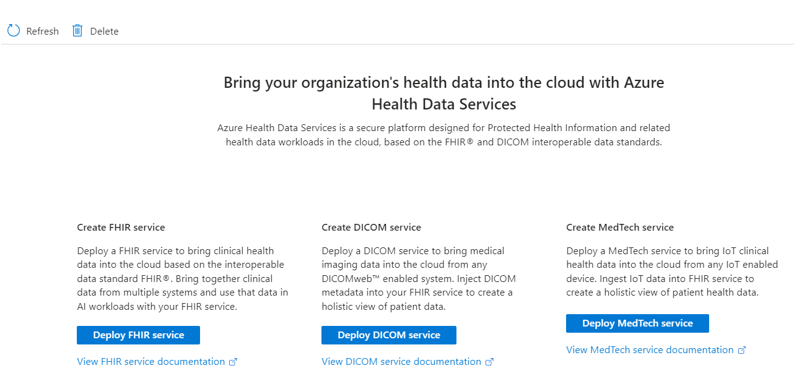

2.	Select **Add DICOM service.**
 
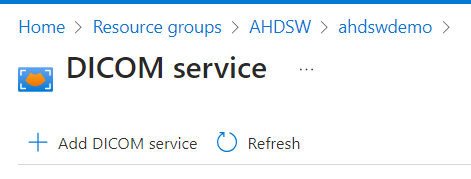

3.	Enter a name for the DICOM service, and then select **Review + create.**
 
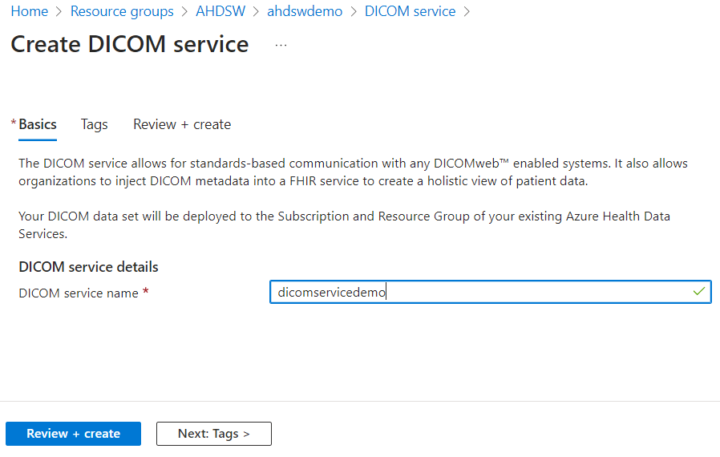

4.	Once the Validation is success, click on **Create**.
 

5.	The deployment takes a couple of minutes to complete. Once it is completed, click on **Go to resource.**
 
 

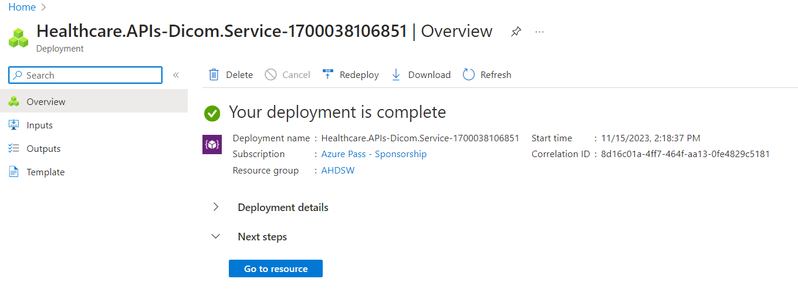

## Exercise 3: Configure Azure roles for access to DICOM data

1.	In your DICOM service pane, in the resources menu, select **Access control (IAM).**

2.	 On the menu, select **+Add > Add role assignment.**
 
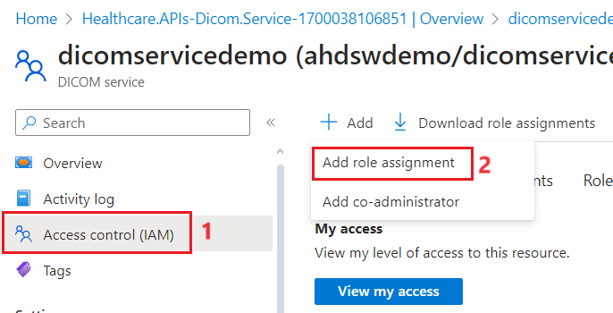

3.	 On the **Add role assignment** page, in the **search by role name, description, or ID** box, enter **DICOM**. In the results, select **DICOM Data Owner**. Click on **Next**.
 
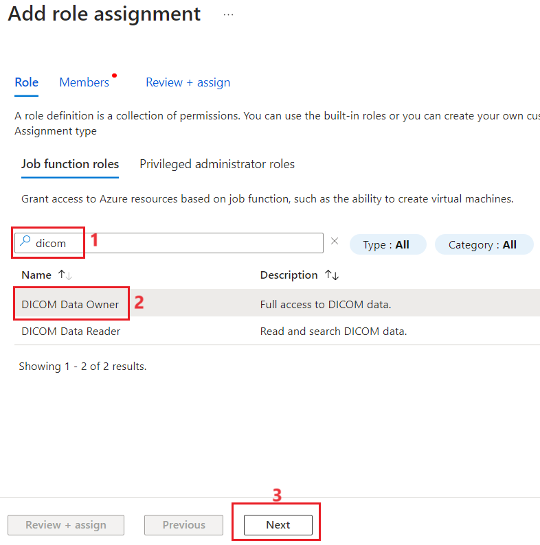

4.	Select the **+Select Members** option.
 
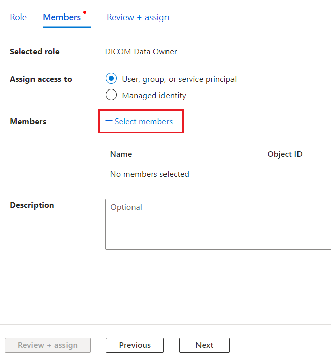

5.	 In the **Select members** pane in the **Select** box, enter your Administrator account name and Application - **myhealthapiapp**, and click on **Select** to proceed further. Click on **Review + Assign.**
 

6.	Click on Review + Assign again. The roles are now assigned successfully. 

7.	You can check in Role assignments tab for confirmation.

## Exercise 4: Import Postman environment and collection files to connect with DICOM service

1.	 Access the Postman environment template for DICOM service at (https://github.com/microsoft/azure-health-data-services-workshop/blob/main/Challenge-08%20-%20DICOM%20service/postman/dicom-service.postman_environment.json).

2.	 Download the file.

3.	 Launch the Postman application, click on your **Environments**  on the left and select the **Import** button.
 

4.	Select the file that you just downloaded by navigating to the downloaded location.
  
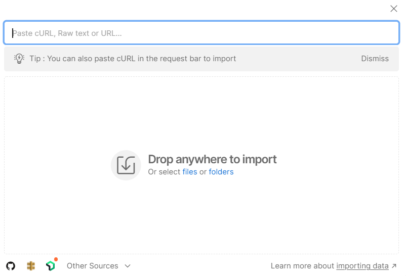

5.	Select the **dicom-service.postman_environment.json** file that you just saved.

6.	Now, access the **Conformance-as-Postman.postman_collection.json** file available at https://github.com/microsoft/dicom-server/blob/main/docs/resources/Conformance-as-Postman.postman_collection.json and download the file as before.

7.	 Import the file as you did previously.

## Exercise 5: Configure Postman environment

You will now configure a new Postman environment for DICOM service (dicom-service).

1.	 For the dicom-service Postman environment, you will need to retrieve the following values from your existing fhir-service Postman environment. You can view the values in existing environment which you used to perform FHIR tasks.

   i.	 **tenantId**

   ii.	 **clientId** - Application (client) ID for Postman service client app

   iii. **clientSecret** - Client secret for your Postman app

2.	Retrieve the following new values from Azure:

    i.	 **resource** - https://dicom.healthcareapis.azure.com

    ii.	 **baseUrl** - Service URL appended with /v1.

      a.	 Go to **Portal > (your Resource Group) > (your DICOM service) > Overview > Service URL.**

      b.	 Copy and add **/v1** on the end: **(https://(your workspace name-your dicom service name).dicom.azurehealthcareapis.com/v1).**

3.	 Populate the above parameter values in your **dicom-service** Postman environment. Input the values in the **CURRENT VALUE** column. Leave **bearerToken** blank.
 

4.	 Make sure to select **Save** to retain the dicom-service environment values.

## Exercise 6: Populate DICOM service with single instance images

From here, you will be using the DICOM service for the features outlined in the objectives at the beginning of this lab. In this exercise, you will use an already configured Postman collection to execute the series of tasks.

1.	 In Postman, make sure you have selected your **dicom-service** environment as the active environment.
 

2.	Select the **FHIR calls** collection. Duplicate the **POST AuthorizeGetToken** request and move the duplicated call to the **Conformance-as-Postman** collection.
 
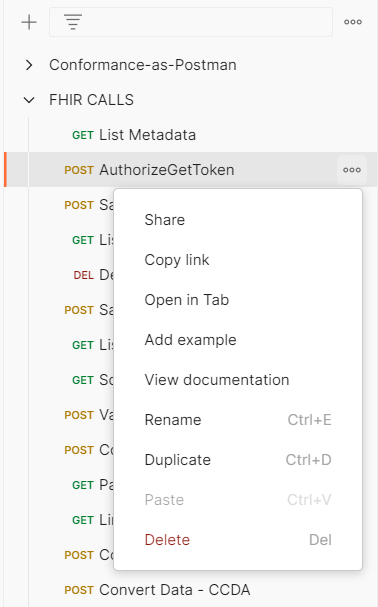

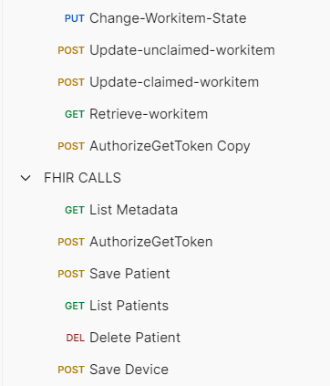

3.	 Select the **Conformance-as-Postman** collection, and on the **Authorization** tab, verify that the **Type** field is set to **Bearer Token** and the **Token** field is set to **{{bearerToken}}**. **Save** it.
 

4.	 Select the **POST AuthorizeGetToken** (Duplicate and copied) request and select **Send**. You should receive a 200 OK message in response. Your access token is now saved to the bearerToken environment variable in your dicom-service Postman environment. Access tokens expire after 60 minutes. A refresh can be obtained by sending the **POST AuthorizeGetToken** request again.
 
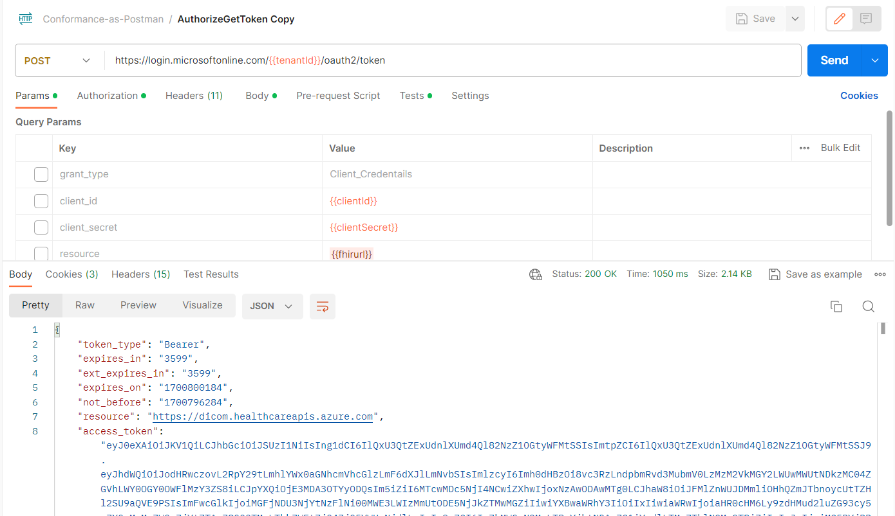

5.	 Once your dicom-service Postman environment is set up and you have obtained an access token, please go to the repo at (https://github.com/microsoft/dicom-server/tree/main/docs/dcms) and download the three DICOM instance files **(.dcm)** to your Postman directory (C:\Users[your username]\Postman\files).
 

6.	 Then, for each of the three POST Store-single-instance calls in the **Conformance-as-Postman** collection,

 i.	 Ensure the URL is **{{baseUrl}}/studies**. Change if needed.
 
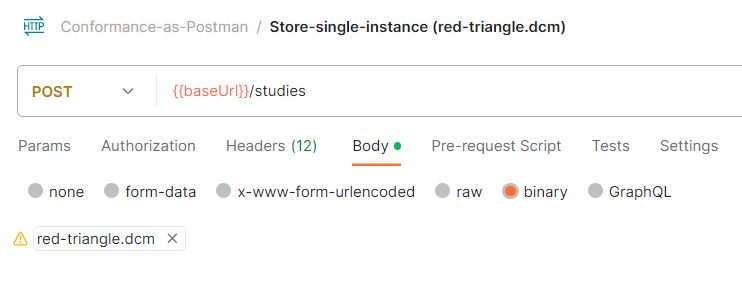
 
 ii. Go to **Body**, select the **x** next to the filename.
 
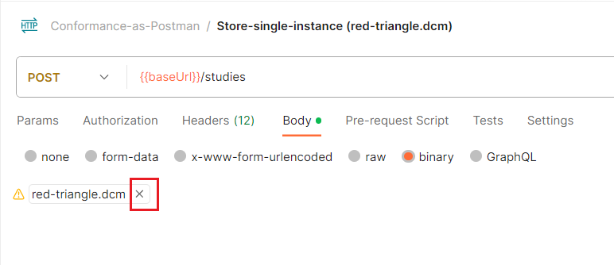
 
 iii. Select **Select File** and choose the appropriate **.dcm** file (downloaded in the previous step) and select **Open**.
 

7.	 Save each call.

8.	 Press **Send** for each **POST Store-single-instance(red-triange.dcm)** call and you will populate your DICOM service.
 
 
 
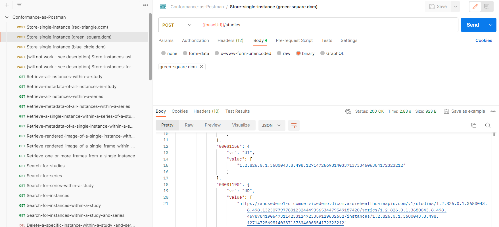

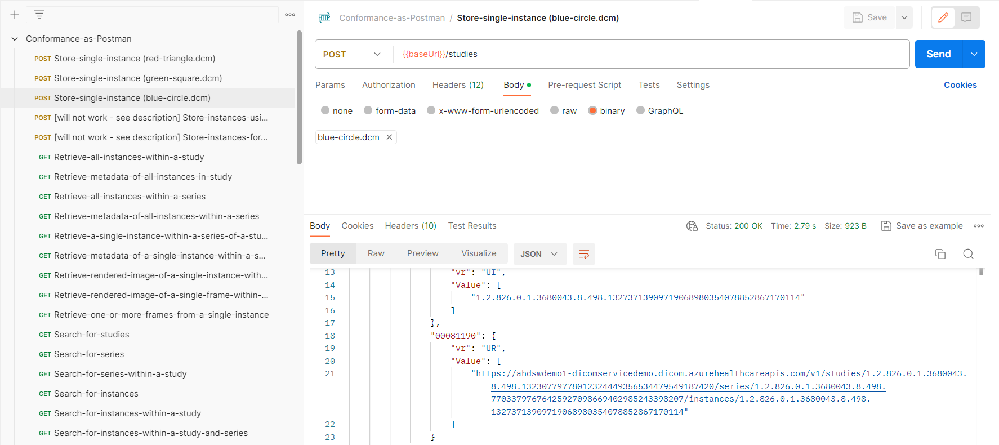
